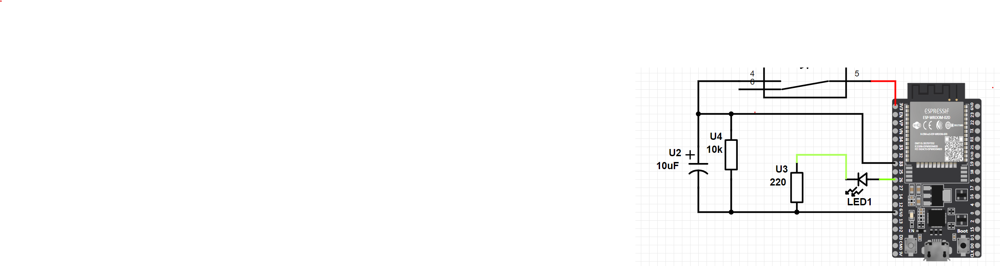

# ESP32 QUEUE EXAMPLE WITH BUTTON

This is a project sample demonstrating the usage of QUEUE in `freertos/queue.h` on an ESP32 microcontrolle0r.
The project When the button is pressed, a value is passed to queue ,after that reciever of queue set led status

## Requirements

- ESP32 development board or a compatible microcontroller.
- VSCode editor and ESP-IDF extention for VSCode.
- 1x220 ohm resistor
- 1x10 kohm resistor
- 10uF electrolytic Capacitor
## Hardware Setup
ESP32 DevKit V4 board is used fot this project wire components as the picture below:

## Usage

1. Connect an LED to GPIO pin 26 (LedPin) and a button to GPIO pin 33 (ButtonPin).
2. Include the required header files and libraries.
3. Define the LED and button GPIO pin numbers.
4. Create tasks for the button and LED operations using the xTaskCreatePinnedToCore() function.
5. Implement the button task (ButtonTaskFunc) and LED task (LedTaskFunc) functions.
6. Configure the GPIO pins for the button and LED using gpio_config().
7. Create a queue (ButtonToLedQueue) using xQueueCreate() to communicate between the tasks.
8. Within the button task, monitor the button state and send the corresponding state to the LED task via the queue.
9. Within the LED task, receive the button state from the queue and control the LED based on the received state.


## Building and Flashing

To build and flash the code to your ESP32 microcontroller, follow these steps:

1. Download repository and extract it. 
2. Open Visual Studio Code (VSCode) and go to File → Open Folder. Choose the `ESP32_IDF-EXERCISES-main\ESP32FreeRTOSQueue\`  folder.
3. Modify the `.vscode\settings.json` file with the following configuration:
```
{
    "idf.adapterTargetName": "esp32",
    "idf.portWin": "COM3",
    "idf.monitorBaudRate": "115200"
}
```
## References :

[1] https://esp32tutorials.com/esp32-esp-idf-freertos-queue-tutorial/
