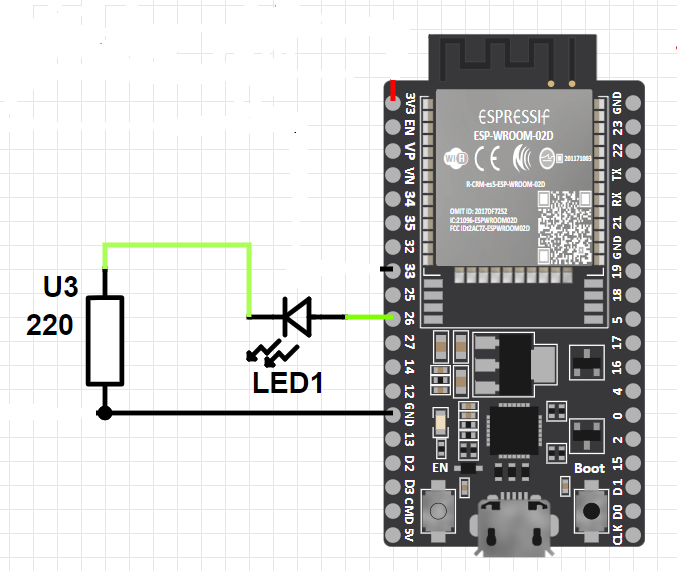

# ESP32 MUTEX EXAMPLE WITH LED

This is a project sample demonstrating the usage of Mutex in `freertos/semphr.h` on an ESP32 microcontrolle0r.
This code controls an LED using an ESP32 microcontroller. It includes two tasks, `LedOnTask` and `LedOffTask`, which alternate turning the LED on and off. The code utilizes FreeRTOS to manage the tasks and a semaphore (xSMutex) to synchronize access to the LED.

## Requirements

- ESP32 development board or a compatible microcontroller.
- VSCode editor and ESP-IDF extention for VSCode.
## Hardware Setup
ESP32 DevKit V4 board is used fot this project wire components as the picture below:

## Usage
1. Compile and flash the code to the ESP32 microcontroller using the ESP-IDF development environment.
2. Observe the LED turning on and off in an alternating pattern.

Note: You can modify the delays in the tasks (`vTaskDelay`) to change the interval between LED on and off states.


## Building and Flashing

To build and flash the code to your ESP32 microcontroller, follow these steps:

1. Download repository and extract it. 
2. Open Visual Studio Code (VSCode) and go to File → Open Folder. Choose the `ESP32_IDF-EXERCISES-main\ESP32_Mutex\`  folder.
3. Modify the `.vscode\settings.json` file with the following configuration:
```
{
    "idf.adapterTargetName": "esp32",
    "idf.portWin": "COM3",
    "idf.monitorBaudRate": "115200"
}
```
## References :

[1] https://esp32tutorials.com/esp32-freertos-mutex-esp-idf/
