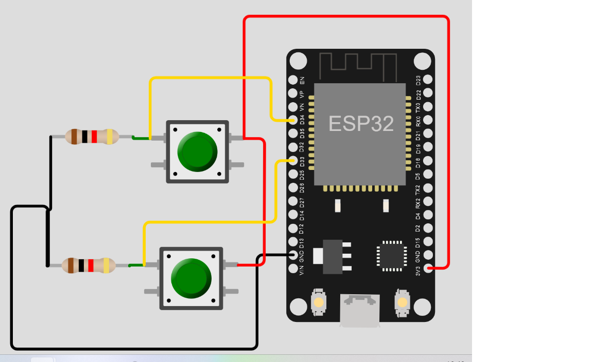

# ESP32 FreeRTOS Event Groups

This is a project sample demonstrating the usage of Event Groups in `freertos/event_groups.h` on an ESP32 microcontrolle0r.
This is a C program for ESP32 that reads the status of two buttons connected to GPIO pins and logs the button presses. It uses the FreeRTOS (Real-Time Operating System) to handle multitasking and event-driven programming.

## Requirements

- ESP32 development board or a compatible microcontroller.
- VSCode editor and ESP-IDF extention for VSCode.
## Hardware Setup
ESP32 DevKit V4 board is used fot this project wire components as the picture below:

## Code Structure

- `main.c`: This is the main program file that sets up the tasks and event group.
- `Button1_ReadFunction`: This task reads the status of Button 1 and triggers an event when it is pressed.
- `Button2_ReadFunction`: This task reads the status of Button 2 and triggers an event when it is pressed.
- `ButtonInfoTask`: This task waits for the events triggered by Button 1 and Button 2 and logs the button presses.


## Building and Flashing

To build and flash the code to your ESP32 microcontroller, follow these steps:

1. Download repository and extract it. 
2. Open Visual Studio Code (VSCode) and go to File → Open Folder. Choose the `ESP32_IDF-EXERCISES-main\Esp32_FreeRTOSEventGroups\`  folder.
3. Modify the `.vscode\settings.json` file with the following configuration:
```
{
    "idf.adapterTargetName": "esp32",
    "idf.portWin": "COM3",
    "idf.monitorBaudRate": "115200"
}
```
## References :

[1] https://esp32tutorials.com/esp32-freertos-event-groups-esp-idf/
